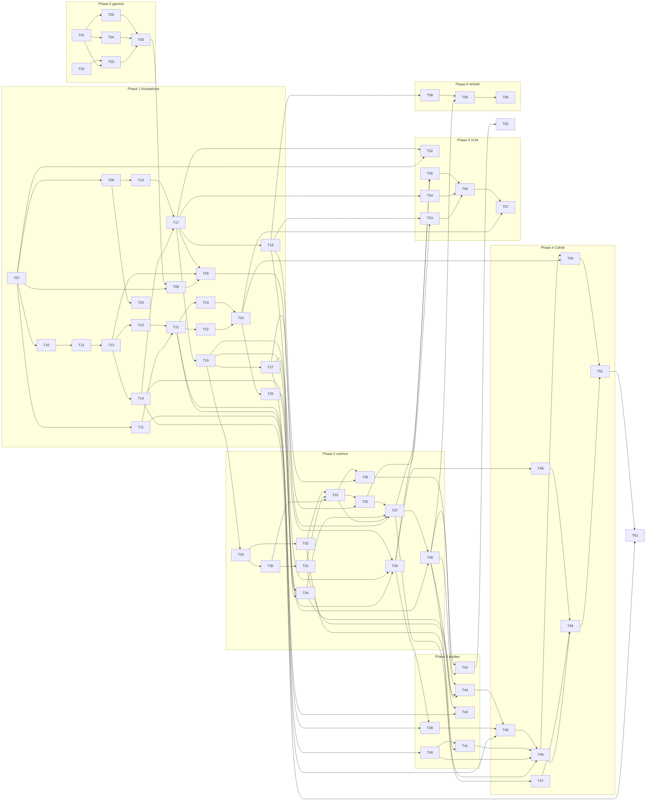

# Implementation plan: Venti, DISP-CAL, VLM, validation package

Companion to [specs.md](specs.md) (PRD v0.1, 2026-10-05). Requirement IDs (R-G1, R-S2, …), trade-study IDs (TS-G1, …) and milestones (M0–M6) refer to the PRD.

## How to read this plan

- **Phases** follow the PRD milestones. Phases 0 and 1 run in parallel; phase 3 runs in parallel with phase 2.
- **Tasks** are numbered `T01`–`T62`. Each lists `Depends on:` task IDs. A task may start when all its dependencies are done, unless a subtask says otherwise.
- **Subtasks** are checklist items. One subtask is roughly one PR or one commit under the `git-commit-pr` skill: a single concern, with tests in the same change (`unit-tests` skill).
- **Definition of done** for every task, unless the task says otherwise:
  - tests for the new behaviour pass in `pixi run -e dev test`;
  - pre-commit passes;
  - the golden test is green, or was regenerated on purpose with the diff explained (`workflow-regression` skill);
  - the PR was reviewed by the owner and merged into the fork's `main` (or the release branch named in the task).
- **Repos:** `venti-dev` (Venti), `cal-disp`, `geepers`, `<validation>` (name TBD, T11), `<vlm>` (name TBD, T52). All work happens on `mgovorcin/*`. Upstream PRs happen only in T06 and T51.
- No orphan tasks: T01, T02 and T07 are the only tasks with no dependencies, and every task is a dependency of at least one other task or is a release task (T06, T51, T57, T60, T61, T62).

---

## Phase 0: Gamma 0.3 release (M0, week 1)

Branch: `cal-disp` `gamma-release` (HEAD `7085ec9`). Local clone: `00_tools/src/cal-disp`. The algorithm is frozen; only packaging, documentation and reproducibility work.

### T01. Confirm the gamma configuration with Talib
**Depends on:** none
**Context:** The delivered gamma 0.3 (600 km window, tropo on, unwrap on) was never validated end to end; our `gamma-release` has unwrap **off** and differs from the delivered `calibration` by a median of −6.7 cm. Talib's own validation used 30 km and tropo off. The release can't be tagged until one configuration is agreed. Open questions are in `gamma_release/delivery_docs_review.md`.
- [ ] T01.1 Write a one-page decision memo: the three configurations (delivered, Talib's validated, ours), the GNSS-grid bias of each (−9.3 cm vs +0.5 cm), and the recommendation (600 km, tropo on, unwrap off).
- [ ] T01.2 Send the memo and the four questions from `delivery_docs_review.md` to Talib; record the answers in `cal-disp/docs/decisions/0001-gamma-config.md`.
- [ ] T01.3 Freeze `test_golden/configs/algorithm_parameters.yaml` to the agreed values; revert the `output2` paths noted in `GAMMA_RELEASE_HANDOFF.md`.

### T02. Secure a Docker build host and build the gamma image
**Depends on:** none
**Context:** No Docker daemon was available on aurora, so `docker/Dockerfile` + `conda-lock.txt` on `gamma-release` have never been built. The golden must be produced inside the image because tropo reprojection depends on the GDAL version. Use the `docker-build` skill (BuildKit, pinned, non-root).
- [x] T02.1 Pick the build host (a laptop with Docker, an EC2 builder, or a rootless `podman` on aurora); document it in `docker/README.md`. *Result:* aurora itself has a working Docker daemon (`/var/lib/docker` 64 GB, 25 GB free); `docker/build-docker-image.sh` already passes `--network=host`, which this host needs.
- [x] T02.2 Build `cal-disp:0.3.0-rc` from the checkout with `docker/build-docker-image.sh`; fix any lock or Dockerfile breakage in small PRs. *Result 2026-10-05:* built first time from `gamma-release` `7085ec9` without changes, 1.5 GB; log `tmp/caldisp_docker_build.log`.
- [x] T02.3 Record the image digest and the resolved package list; compare with `OPERA_TROPO_CalVal_Installed_Packages.csv`-style listing and commit it as `docker/installed_packages_0.3.0.csv`. *Done 2026-10-05:* `docker/BUILD_RECORD.md` + `docker/installed_packages_0.3.0rc.csv` on cal-disp `feature/docker-build-record` (`a3e4fd7`).

### T03. Rebuild the golden inside Docker and validate
**Depends on:** T01, T02
**Context:** `scripts/build_golden_output.sh` builds the reference product; `scripts/run_validation.sh --golden-dir test_golden` reruns the workflow and compares at tolerance 1e-6 (`cal-disp validate` checks values, attrs, CRS, dtype and identification). Both must run inside the image, mounting `test_golden/` (4.9 GB: `configs`, `input_data`, `golden_output`).
- [ ] T03.1 Run `build_golden_output.sh` inside the image with the T01 config; store the product in `test_golden/golden_output` (exactly one `OPERA_L4_DISP-CAL-S1_*.nc`).
- [ ] T03.2 Run `run_validation.sh` inside the image; it must print `✓ Validation passed`. Save the log as `test_golden/validation_0.3.0.log`.
- [ ] T03.3 Run `run_validation.sh` on aurora with the pixi `dev` env against the Docker-built golden; record whether it passes at 1e-6 (expected: possibly not, because of GDAL). Document the result in `docs/development.md`. *Dry run 2026-10-05 (before T01):* the reverse direction already holds — `run_validation.sh` inside `cal-disp:0.3.0-rc` (GDAL 3.13.3, Python 3.13.15, rasterio 1.5.1) reproduces the aurora-built golden at 1e-6, peak 6.31 GB (log `tmp/caldisp_docker_validate.log`). So for the gamma configuration the GDAL-version dependence of the tropo reprojection does not change the product at that tolerance.
- [ ] T03.4 Write `test_golden/MANIFEST.sha256` for inputs and golden output and commit it (data itself stays out of git).

### T04. Fix the delivery documents
**Depends on:** T01
**Context:** `gamma_release/DOCUMENT_FIXES.md` holds an H/M/L table per document. Product Spec overstates the product (unwrap, iono, event DB), calls it HDF5, and disagrees with the product on version, pixel convention, `time`, `track_number`, `auxiliary/spatial_ref`, int32 vs int64 and `software*` attrs. SAS guide says 18 GB (now 6.4 GB), has an r2/r3 URL mismatch and a wrong validate command. Sources are in `/u/aurora-r0/cabrera/opera_vlm/deliveries/gamma_delivery/documents/`; text copies in `gamma_release/docs_text/`.
- [ ] T04.1 Apply the H items of `DOCUMENT_FIXES.md` to the Product Spec; add a section that states the algorithm parameters.
- [ ] T04.2 Apply the H items to the SAS Design / User Guide (memory, URLs, validate command).
- [ ] T04.3 Apply the H items to the Delivery Summary (version, tar/zip name).
- [ ] T04.4 Walk through M and L items; fix or mark "deferred to v0.5" with a reason.
- [ ] T04.5 Cross-check the spec against the T03 product with `cal-disp validate --group all` style attribute listing; no spec/product mismatch remains.

### T05. Confirm product URLs and version string
**Depends on:** T01
**Context:** `product_data_access`, `static_layers_data_access`, `source_data_access` were `example.com` placeholders upstream; `gamma-release` fills them from input metadata. `reference_document` and the product version (v0.1 vs v1.0) are unresolved (`TODO.md`).
- [ ] T05.1 Get the final URLs and the version string from Talib / the OPERA PGE team.
- [ ] T05.2 Set them in `src/cal_disp/product/output/_identification.py` and `_metadata.py`; update the tests that check them.
- [ ] T05.3 Confirm the filename pattern `OPERA_L4_CAL-DISP-S1_IW_F#####_VV_<ref>_<sec>_v<ver>_<prod>.nc` matches the spec after T04.

### T06. Release gamma 0.3
**Depends on:** T03, T04, T05
**Context:** Upstream `opera-adt/cal-disp` `main` is at `88c0c46`; `gamma-release` is 52 commits past it. Delivery packaging uses `addArtFile.sh` (untracked in `CAL/cal-disp`; move it into `scripts/`).
- [ ] T06.1 Rebase or merge `gamma-release` onto upstream `main`; resolve conflicts; all 478 tests pass.
- [ ] T06.2 Open the upstream PR with a changelog (memory fix, unwrap off, metadata, validate depth, lock reproducibility) and the T03 validation log.
- [ ] T06.3 Tag `v0.3.0` on the fork and upstream after merge; `pep440-version.sh` reports it.
- [ ] T06.4 Build the delivery package (`addArtFile.sh`): image tar, docs from T04, `installed_packages`, validation log; hand over.
- [ ] T06.5 Update `GAMMA_RELEASE_HANDOFF.md` status to "released" and move remaining items to `TODO.md`.

---

## Phase 1: Foundations (M1, weeks 1–2)

### T07. Shared engineering-standards kit
**Depends on:** none
**Context:** PRD §6 and §11. The kit is applied to every repo (T08–T11, T52). Source material: `00_tools/.claude/skills/` (`git-commit-pr`, `unit-tests`, `workflow-regression`, `docker-build`, `install.sh`), geepers' SPDX/NOTICE convention, and cal-disp's existing `.pre-commit-config.yaml`.
- [x] T07.1 Create `00_tools/standards/` with: `.pre-commit-config.yaml` (ruff lint+format, mypy, nbstripout, check-yaml/toml, end-of-file-fixer, SPDX header check script), `pixi` task block template (`test`, `lint`, `docs`, `golden`, `e2e`; envs `default`, `dev`, `ops`), `.github/ISSUE_TEMPLATE/{feature,bug,science,release}.yml`, `.github/pull_request_template.md`, `CLAUDE.md` template with sections *Architecture*, *Invariants*, *Commands*, *Golden policy*.
- [x] T07.2 Write `scripts/spdx_check.py` (fails on `.py` files missing the Apache-2.0 + repo citation header) with tests.
- [x] T07.3 Write `apply_standards.sh <repo>` that copies the kit without overwriting repo-specific content, and installs the skills via `install.sh`.
- [x] T07.4 Document the branch/PR policy (small single-concern PRs, conventional commits, no direct pushes to `main`, Claude PRs reviewed by owner) in `00_tools/standards/CONTRIBUTING.md`.

### T08. Apply standards to Venti (`venti-dev`)
**Depends on:** T07
**Context:** Clone at `00_tools/src/Venti` (`origin` = `mgovorcin/venti-dev`, `upstream` = `opera-adt/Venti`). Venti has `.readthedocs.yaml` and a pixi docs task but no `docs/` or `mkdocs.yml`; `environment.yml` was emptied on the `models` branch. `docs/specs.md` and `docs/plan.md` are untracked.
- [x] T08.1 On branch `feature/prd-docs` (the tree rule in `00_tools/CLAUDE.md`: never commit on `main`), commit `docs/specs.md` and `docs/plan.md` (`docs: add PRD and implementation plan`); push to `origin` and open the PR on the fork.
- [x] T08.2 Run `apply_standards.sh`; commit pre-commit config, templates, `CLAUDE.md` (Invariants: sensor-agnostic core, `calibration == Σ components`, no heavy deps in core).
- [x] T08.3 Add `pixi.toml`/`[tool.pixi]` with `default`, `dev`, `ops` envs; commit `pixi.lock`; `pixi run -e dev test` passes on the existing 132 tests.
- [x] T08.4 Enable pre-commit.ci and a GitHub Actions `test` workflow on the fork. (Actions: enabled on `mgovorcin/venti-dev`, `test.yaml` + `pre-commit.yaml` + `docs.yaml` run on PRs. pre-commit.ci: must be switched on at https://pre-commit.ci by the repo owner — not scriptable.)

### T09. Apply standards to cal-disp
**Depends on:** T06, T07
**Context:** Do this after the gamma release so the release diff stays clean. cal-disp already has pre-commit.ci, mkdocs and pixi; align them with the kit rather than replacing them. Two pytest configs existed (structural review); keep one.
- [ ] T09.1 Run `apply_standards.sh`; reconcile with the existing pre-commit config; one pytest config.
- [ ] T09.2 Add `ops` pixi env mirroring the Docker image; `conda-lock` generated from it; document in `docker/README.md`.
- [ ] T09.3 `CLAUDE.md` with Invariants: CLI and runconfig frozen (PRD §2.2), additive `algorithm_parameters.yaml`, golden policy.
- [ ] T09.4 Add CI smoke test: `cal-disp config` + `cal-disp run` on a 64×64 synthetic input (fixture from `tests/`), no network.

### T10. Apply standards to geepers fork
**Depends on:** T07
**Context:** `00_tools/src/geepers` (`origin` = fork, `upstream` = `opera-adt/geepers`, on `main`, clean). geepers already has SPDX headers and ruff; mainly add templates, `CLAUDE.md`, pixi.
- [x] T10.1 Run `apply_standards.sh`; commit.
- [x] T10.2 Add pixi envs; `pixi run -e dev test` passes (uses `pytest-recording` cassettes, no live network). *Result 2026-10-05:* `dev`/`ops` envs added; full suite 348 passed / 4 skipped (the one failure, the kit checker lacking a header, is fixed); pre-commit green after an `affine` 3 warning filter, mypy 2.3.1 targeting 3.12 and 21 genuine type fixes (`fix(types)` commit). Note: the suite is network-bound (~15–19 min here), not cassette-only as assumed.
- [x] T10.3 Create branch `feat/extras-split` for T12–T15. *Created as `feature/extras-split` (naming convention) on top of `feature/standards`; holds the T12 audit.*

### T11. Create the validation package repo
**Depends on:** T07
**Context:** New repo under `mgovorcin/`, name TBD (PRD §7.5 Q4; proposal `disp-validate`). It will depend on `geepers[analysis]` and must never be in the operational image.
- [ ] T11.1 Create the repo from the kit (the `sas-scaffold` skill in `00_tools` provides the CLI/pixi/pre-commit/CI skeleton; skip its PGE runconfig and product-writer parts, this is a tool, not a SAS): `src/<pkg>/`, `tests/`, `docs/`, pixi, CI, `CLAUDE.md` (Invariants: uses only independent GNSS — UNR daily stations and MIDAS — never the calibration grid).
- [ ] T11.2 Add the dependency list: `geepers[analysis]`, `xarray`, `rioxarray`, `scipy`, `pandas`, `jinja2`, `matplotlib`; pin `venti-dev` only as an optional extra.
- [ ] T11.3 Write `docs/scope.md` from PRD §3.4 and §2.7 (metrics, modes, gate, outputs, audience).

### T12. geepers dependency audit
**Depends on:** T10
**Context:** geepers core deps are heavy (dask, zarr, pandera, lxml, rasterio, rioxarray, geopandas, pyogrio). The operational image needs only UNR grid/station retrieval (`gps_sources/unr_grid.py`, `gps_sources/unr.py`, `gps_sources/base.py`, `schemas.py`) and, in `[grid]`, GPS Imaging (`gps_imaging.py`) and Euler (`euler.py`). PRD §4.4: ≤ 4 extras + `[all]`.
- [x] T12.1 Generate an import graph (`pydeps` or a script over `ast`) of `src/geepers`; list third-party imports per module; commit as `docs/dependency_audit.md`.
- [x] T12.2 Propose the partition: `core` = {`gps_sources/*`, `schemas`, `utils`, `io` (reduced)}, `[grid]` = {`gps_imaging`, `euler`, `surface`?}, `[analysis]` = everything else. Record which modules need lazy imports or splitting (e.g. `schemas.py` using pandera).
- [ ] T12.3 Get owner sign-off on the partition (issue on the fork).

### T13. geepers lean core
**Depends on:** T12
**Context:** `pandera` validation in `schemas.py` and `geopandas` in `stations()` are the main core blockers. Options: make pandera optional (validate only if installed), return a `pandas.DataFrame` with lon/lat columns from core and a `GeoDataFrame` only when geopandas is present.
- [x] T13.1 Move heavy deps out of `[project.dependencies]` into extras in `pyproject.toml`; core = `pandas`, `numpy`, `scipy`, `pyproj`, `requests`, `tqdm`.
- [x] T13.2 Make `schemas.py` validation optional (no-op without pandera) with tests for both paths.
- [x] T13.3 Make `gps_sources/base.py` work without geopandas (bbox filter in pandas; `GeoDataFrame` upgrade when available).
- [x] T13.4 Add CI job `core-only`: install `geepers` with no extras in a clean env; `python -c "from geepers.gps_sources import UnrGridSource, UnrSource"` and a cassette-based download test must pass. *Done 2026-10-06 on geepers `feature/extras-split` (4 commits). Also: `tests/test_core_imports.py` subprocess check; pixi `ops`/`core-test` envs; 362 tests pass with extras, 16 in the core-test env. Implemented before the T12.3 sign-off — reversible if the partition changes.*

### T14. `geepers[grid]`: GPS Imaging + Euler, with exclusion areas
**Depends on:** T13
**Context:** R-G5: drop UNR grid nodes inside defo/event areas and re-interpolate them from surrounding nodes with GPS Imaging (median spatial filtering). R-G6/`plate_motion`: Euler pole rotation (ITRF2020-PMM) to ENU velocity per pixel. Venti's `models/plate_motion.py` and `load_itrf.py` are deleted in T17 in favour of this.
- [x] T14.1 Define extra `grid = ["shapely>=2"]` (+ whatever `gps_imaging.py` needs); move `gps_imaging.py`, `euler.py` imports behind it; add `core-only` CI check that importing them without the extra gives a clear `ImportError` message. *Result:* `gps_imaging` and `euler` need only numpy/scipy/pyproj (core), so they stay importable without the extra; shapely is required only by `reinterpolate_nodes` via `_optional.require("shapely")`, whose message names `geepers[grid]` (tested).
- [x] T14.2 Add `gps_imaging.reinterpolate_nodes(grid_df, exclude: GeoSeries | list[Polygon], radius_km, min_neighbors) -> DataFrame` that replaces E/N/U velocity and σ at excluded nodes by the GPS-Imaging estimate from non-excluded neighbours; tests with a synthetic plane + bowl. *Done 2026-10-06:* `gps_imaging.reinterpolate_nodes(nodes, exclude, columns=…)` (shapely via `require`, MSF estimate from the nodes outside, sigma = robust scatter, `reinterpolated` flag); synthetic plane+bowl test recovers the plane to < 1 mm/yr inside the polygon.
- [x] T14.3 Add `euler.plate_velocity_enu(lon, lat, plate: Literal["NA","PA","CA",...], model="ITRF2020-PMM") -> (vE, vN, vU=0)` vectorized over arrays; tests against published site velocities (reuse Venti `load_itrf.py` JSON). *Done 2026-10-06:* `euler.plate_velocity_enu(lon, lat, plate, model="ITRF2020-PMM", height=None) -> (ve, vn, vu=0)` mm/yr, codes or PMM names; benchmark-site tests (Houston NA, Hilo PA, San Juan CA) and PA−NA ≈ 45–50 mm/yr across S. California.
  - [x] T14.3a **TODO (2026-10-06): add the ITRF2020 plate table to geepers `[grid]`.** geepers has `EulerPole`/`predict_plate_motion` but no plate catalogue; port Venti's ITRF2014/2020-PMM rotation vectors (Altamimi et al. 2023; `models/load_itrf.py` + its JSON) as `geepers/data/itrf2020_pmm.json` with a loader `euler.plate_pole(plate, model="ITRF2020-PMM") -> EulerPole`; include NA, PA, CA and the other PMM plates; test the NA pole (~88 W, 5 S, 0.70 deg/Myr) and one site velocity per plate. *Done 2026-10-06:* `geepers/data/itrf2020_pmm.json` + `itrf2014_pmm.json` ported from Venti; `euler.load_plate_motion_model`, `plate_pole`, `PLATE_CODES` (NA→NOAM, PA→PCFC, CA→CARB, …). ITRF2020 NOAM pole = (−86.1°, −8.35°, 0.187 deg/Myr); ITRF2014 = (−88°, −5.2°, 0.194).
- [x] T14.4 Add a `PLATE_BY_FRAME` loader hook (reads the frame-parameter table from T27; geepers stays frame-agnostic, just takes a plate string). *Done by design:* `plate_velocity_enu` takes a plate string; the frame→plate lookup lives in the Venti frame-parameter table (T27), geepers stays frame-agnostic.

### T15. `geepers[analysis]` and `[all]`
**Depends on:** T13
**Context:** MIDAS, strain, cross-validation, variability, plotting, zarr/dask workflows go here. Validation package (T21) depends on `[analysis]`.
- [x] T15.1 Define `analysis` (dask, zarr, xarray, rioxarray, rasterio, geopandas, pyogrio, pandera, lxml, matplotlib) and `all = ["geepers[grid,analysis,plot]"]`. *Done in T13's build commit:* `analysis` and `all = ["geepers[grid,analysis,plot]"]`.
- [x] T15.2 CI matrix: `core`, `grid`, `analysis`, `all`; full test suite runs under `all`, subset markers under the others. *Done 2026-10-06:* the pytest CI job is a matrix over pixi envs `test` (full suite) and `core-test` (core subset: `test_core_imports`, `test_plate_table`, `gps_sources`) × {ubuntu, macos}; the pip route is the separate `core-only` job. Path-based selection instead of markers — the core subset is small and explicit.
- [x] T15.3 Update `README.md` install matrix and `CHANGELOG.md`; open PR on the fork; (optionally) draft the upstream PR text for later. *Done 2026-10-06:* README `## Installation` matrix (core / [grid] / [analysis] / [plot] / [all], pixi envs); `CHANGELOG.md` created with the Unreleased entry for the split, the seams, the plate tables and `reinterpolate_nodes`. Upstream PR text: the geepers fork PR #2 body serves as the draft.

### T16. Venti bug fixes and packaging repair
**Depends on:** T08
**Context:** Verified on `upstream/main` `2a7e61f` (2026-10-05): `surface.py:208` calls `correct_region_offset(input_disp=disp, mask=mask, wavelength=wavelength_m)` with the **full radar wavelength** read from the DISP product, but one LOS displacement cycle is λ/2 (2.77 cm for S1) — the corrector shifts by twice the right amount (this is why gamma ships with unwrap off); `models/load_itrf.py:110` imports `.plate_motion.euler_pole`, but `plate_motion` is a module, not a package. Earlier survey items (missing `gnss.reference`/`spatial.processor`, wrong positional arguments, missing pyproject deps) came from a stale `staging` checkout and are already fixed on `main`; re-verify each before working on it. One PR per bullet.
- [x] T16.1 Audit `pyproject.toml` against actual imports in a clean env (`pip install -e .`; import every module); fix what is missing; check the license path and README install instructions.
- [x] T16.2 Fix `load_itrf.py` import (temporary; module is deleted in T17).
- [x] T16.3 Make the unwrap cycle λ/2: `correct_region_offset`/`UnwrapCorrector` take `cycle_m` (documented as λ/2 for displacement, 2π for phase) and `surface.py` passes `wavelength_m / 2`; regression test with a synthetic +1-cycle region.
- [x] T16.4 Confirm the `unwrap_error_correction` flag is honoured end to end (default `False`) with a test.
- [x] T16.5 Round-trip test of cal-disp's `test_golden/configs/algorithm_parameters.yaml` through Venti's config loader.
- [x] T16.6 Run the full test suite and `pre-commit run -a` on `main`; fix anything red; record the baseline in `docs/development.md`.
- [~] T16.7 Rebase the unmerged `models`-branch tropo research into `research/tropo` on the fork (notebooks and `tropo_paper/` only; drop the 1.3 M-line logs). *Done so far:* local branch `research/tropo` = `upstream/models` (`399da80`). *Open:* the uncommitted research in `01_OPERA/VLM/Venti/notebooks/corrections/` (`tropo1.ipynb`, `tropo_gps1.ipynb`, `run_tropo_gps.py`, `tropo_paper/`, `scripts/_stage_static.py`) still has to be copied onto that branch and committed; the 1.3 M-line logs and the UNR zip are left behind.

### T17. Venti package layout: lean core + extras
**Depends on:** T14, T16
**Context:** PRD §4.1/§4.4: core = `io`, geometry, GNSS→LOS, config, `SensorSpec`; extras `[calibration]` (numba, scikit-image), `[decomposition]`, `[models]` (GIA grids), `[research]` (matplotlib, jupyter), `[all]`. Remove `models/plate_motion.py`, `models/load_itrf.py` (→ `geepers[grid]`) and `gnss/unr.py` (→ geepers core). Keep `models/load_gia.py` in `[models]`.
- [x] T17.1 Write `docs/architecture.md` with the target tree: *Done 2026-10-06 as `docs/architecture.md` + ADR-0020:* the package layout is **kept** (cal-disp imports it by name; the lean-core goal is a dependency property); the tree sketched here is superseded.
  ```
  venti/
    core/      io, raster, geometry (ENU↔LOS), config base, sensor.py, gnss_sampling.py
    calibration/   surface, weights, fill, remove_restore, two_pass, uncertainty, tropo, unwrap/
    decomposition/ wls, projection, temporal
    models/        gia
    workflow/      calibration.py, decomposition.py, run.py
  ```
- [x] T17.2 Move modules per the tree with `git mv`; update imports; tests green (one PR, `refactor:` only, no behaviour change). *Done 2026-10-06 (reduced scope per ADR-0020):* only the staging CLIs move — `scripts/staging/*_cli.py` + `utils.py` → `venti.staging`, thin wrappers remain, the `sys.path` hack in `stage_frame_data` is gone. `scripts/staging/unr_cli.py` (a stale copy of `los_cli.py`) left untouched.
- [x] T17.3 Delete `models/plate_motion.py`, `models/load_itrf.py`, `gnss/unr.py`; replace call sites with `geepers.euler` / `geepers.gps_sources.UnrGridSource`; `scripts/get_model_rates.py` uses geepers. *Partly done 2026-10-06:* `models/plate_motion.py`, `models/load_itrf.py` and the ITRF tables deleted; `venti.models` re-exports `geepers.euler`; `scripts/get_model_rates.py` ported (`get_frame_pmm` via `plate_velocity_enu`, units label fixed to mm/year). **`gnss/unr.py` stays until T28**: `GNSSReference` and cal-disp's runconfig depend on its on-disk layout (`grid_latlon_lookup.txt`, tenv8 files).
- [x] T17.4 Define extras in `pyproject.toml`; add CI job `core-only` (import `venti.core` with no extras) and `calibration-only`. *Done 2026-10-06:* extras `calibration`, `decomposition`, `models` (placeholders), `research` (staging + stack data access + notebooks), `test`, `all`; `opera-utils` declared without `[disp]`; pixi envs `ops` (core only) and `core-test`; `core-only` job in `test.yaml`; `tests/test_packaging.py` pins the tiers.
- [x] T17.5 Pin `geepers` from the fork by tag in `pyproject.toml`. *Done 2026-10-06:* `geepers[grid] @ git+https://github.com/mgovorcin/geepers.git@677f95d…` (commit pin; switch to a tag when the fork tags).

### T18. `SensorSpec` abstraction
**Depends on:** T17
**Context:** R-X1. S1: λ = 0.05546576 m, cycle = λ/2 = 2.773 cm, DISP-S1 NetCDF (`/displacement`, `/recommended_mask`, `/water_mask`, `/corrections/solid_earth_tide`, `/timeseries_inversion_residuals`), filename `OPERA_L3_DISP-S1_IW_F#####_VV_<ref>_<sec>_v*.nc`, static LOS ENU + DEM GeoTIFFs. NISAR is implemented in T58; here only the interface and S1.
- [x] T18.1 `venti/core/sensor.py`: `@dataclass(frozen=True) class SensorSpec: name, wavelength_m, cycle_m (property), parse_filename(path) -> ProductId(frame, ref, sec, version), open_displacement(path) -> xr.DataArray, open_mask(path), open_correction(path, name), available_corrections: tuple[str,...], static_layers: dict[str, Path]` + registry `get_sensor("S1")`. *Done 2026-10-06 as `venti/sensor.py` (layout kept per ADR-0020):* frozen `SensorSpec` (wavelength, `cycle_m`, product/static filename grammars, layer names, readers), `ProductId`, `StaticLayerId`, registry `get_sensor`/`sensor_for_file`; `NISAR` registered with `implemented=False` and a pointer to T58.
- [x] T18.2 Implement `S1Spec` by moving the readers out of cal-disp `product/_disp.py` and `_static.py` where they are generic (cal-disp keeps a thin wrapper, T26). *Done 2026-10-06 (reduced):* the readers are thin (`open_displacement`, `open_mask`, `available_corrections`, `open_correction` via `io.read_netcdf_correction`, `read_wavelength`); cal-disp's `DispProduct`/`StaticLayer` keep their richer API and wrap `S1` in T26.3.
- [x] T18.3 Tests: filename parsing (incl. the NISAR pattern raising `UnsupportedSensor` for now), cycle length, correction listing on the golden DISP file (fixture via `MANIFEST.sha256` check, skipped if data absent). *Done 2026-10-06:* `tests/test_sensor.py` — filename parsing incl. a NISAR name raising `UnsupportedSensorError`, cycle length, wavelength read/fallback/mismatch, masks and corrections on a fabricated DISP file.

### T19. Venti algorithm-parameters schema (additive, versioned)
**Depends on:** T17
**Context:** PRD §2.2: new science options live only in `algorithm_parameters.yaml`, with defaults that reproduce gamma. Existing cal-disp keys: `grid_type`, `reference_frame`, `unwrap_error_correction`, `apply_tropo_correction`, SET flag, `window_size_meters`, `downsample_factor`, MAD thresholds, `mask_fit_residual_outliers`, `weight_fit_by_gnss_uncertainty`, gaussian smoothing. New keys (all optional): `surface.method: windowed_plane|loclin`, `surface.cutoff_wavelength_meters: 50000`, `surface.fill_gaps: bool`, `weights.coherence_power: 8`, `weights.quantile_mask: bool`, `two_pass: bool`, `tropo.mode: off|stratified|full|auto`, `gnss.buffer_meters: 50000`, `gnss.exclude_defo_nodes: bool`, `uncertainty.k_grid: float|"frame_table"`, `unwrap.enabled: false`, `schema_version: 2`.
- [x] T19.1 Add the pydantic model in `venti/core/config.py` with `schema_version` and defaults = gamma behaviour; `extra="forbid"`. *Done 2026-10-06 in `venti/workflow/config.py` (layout kept):* `SurfaceOptions`, `WeightOptions`, `TropoOptions`, `GnssOptions`, `UncertaintyOptions`, `UnwrapOptions` nested in `CalibrationOptions`; downsample keys modelled; `schema_version` on `AlgorithmParameters`; `extra="forbid"`; `unwrap_error_correction` default → off (R-U1).
- [x] T19.2 Loader accepts the gamma file unchanged (schema_version 1 → upgraded in memory) with a test on `test_golden/configs/algorithm_parameters.yaml`. *Done 2026-10-06:* `AlgorithmParameters.from_dict/from_yaml` treat a file without `schema_version` as 1 and upgrade it in memory; tested on `tests/data/caldisp_algorithm_parameters_gamma.yaml` (values preserved, groups at gamma defaults).
- [x] T19.3 `docs/algorithm_parameters.md`: every key, default, unit, which requirement it implements, which release introduced it. *Done 2026-10-06:* `docs/algorithm_parameters.md` — every key with default, unit, requirement, since-version and the v0.5 target values.

### T20. Venti documentation site
**Depends on:** T08
**Context:** `.readthedocs.yaml` exists but no `mkdocs.yml`. Mirror cal-disp's mkdocs setup (material, mkdocstrings, mkdocs-jupyter).
- [x] T20.1 Add `mkdocs.yml`, `docs/index.md`, nav: Specs, Plan, Architecture, Algorithm parameters, API.
- [x] T20.2 `pixi run docs` builds with `--strict`; CI job publishes to `gh-pages` on the fork.
- [x] T20.3 Add `docs/decisions/` (ADR format) and backfill D1–D19 from the PRD decision log as ADR-0001…0019 (one file each, short).

### T21. Validation package: port the e2e core
**Depends on:** T11, T15
**Context:** `trade studies/e2e_validation/validate_stack.py` has the DD semivariogram sill (median γ for pairs ≥ 50 km, station-bootstrap CI), `VelocityFit` (OLS velocity per pixel/station), `StationSampler`, MIDAS fetch; `calibrate_stack.py` applies CAL to a stack; `stage_tropo.py`. Station UH01 is excluded. Turn scripts into a library with no hard-coded paths.
- [ ] T21.1 `dd_sill(stack, stations, min_pair_km=50, n_boot=1000) -> SillResult(sill, ci_lo, ci_hi, n_pairs)`; tests on a synthetic stack with known variogram.
- [ ] T21.2 `velocity_fit(stack, dates) -> (v, σ_v)` and `station_velocities(frame, stations, source="midas") -> DataFrame` via `geepers[analysis]`; LOS projection with the static ENU layer; tests with cassettes.
- [ ] T21.3 `StationSampler` with an exclusion list (config, not code) and a `held_out` split API (used by TS-G1 so k-fitting stations never enter validation).
- [ ] T21.4 `apply_calibration(stack, cal_products) -> stack` (port `calibrate_stack.py`), chunked with xarray/dask.

### T22. Station classes and per-class metrics
**Depends on:** T21
**Context:** PRD §3.4: metrics per class stable / subsiding / coastal / in defo area / near event. Classification needs the defo/event GeoJSON (T41 later; here use any GeoJSON) and a coast mask (water mask from the DISP product or Natural Earth).
- [ ] T22.1 `classify_stations(stations, defo_db, event_db, water_mask, v_gnss, subsiding_thresh=-3 mm/yr, coast_km=10) -> Series[class]`.
- [ ] T22.2 `metrics_by_class(v_insar, v_gnss, σ) -> DataFrame[class, n, bias, rmse, corr, std_z, coverage95]`.
- [ ] T22.3 σ realism: `normalized_residuals(z)` with std(z) and 95% coverage; report-only (R-E4).

### T23. Gate logic and comparison modes
**Depends on:** T21
**Context:** PRD §2.7 FAIL rules (sill not below raw; sill up > 5% vs baseline and significant; RMSE or |bias| up > 0.2 mm/yr; golden-epoch check fails), target |bias| ≤ 1 mm/yr. Rules must be configurable per release.
- [ ] T23.1 `gate.yaml` schema (thresholds, significance level, per-class targets) + pydantic model.
- [ ] T23.2 `evaluate(candidate, raw, baseline, gate) -> GateResult(passed, reasons[])` with tests for each FAIL rule.
- [ ] T23.3 Golden-epoch check: compare the candidate's pair product at the golden epochs with `cal-disp validate` tolerance; wrap the CLI call.

### T24. Reports and traceability
**Depends on:** T22, T23
**Context:** Audience: internal team + OPERA CalVal review. Outputs: `metrics.json`, `stations.csv`, HTML (PDF via `weasyprint` optional) per frame, a release summary across frames, and a requirements traceability table (requirement ID → metric → result → pass/fail). Use the `dataviz` conventions for figures.
- [ ] T24.1 Jinja2 templates: `frame_report.html` (sill before/after with CI, velocity scatter vs MIDAS, bias/RMSE by class, σ realism, map of stations by class), `release_summary.html`.
- [ ] T24.2 `write_outputs(result, out_dir)` → `metrics.json`, `stations.csv`, `report.html`, figures as SVG.
- [ ] T24.3 `traceability.yaml` mapping R-* IDs to metrics; rendered as a table in the release summary.
- [ ] T24.4 Snapshot test of the rendered HTML on a tiny synthetic run.

### T25. Validation CLI, caching, batch execution
**Depends on:** T24
**Context:** Runs are cached by code+config hash (as `e2e_validate.sh` does). Benchmark runs go through AWS Batch with `batchkit` (`/batchkit` skill). Work dir on aurora: `/mnt/aurora-z0/govorcin/cal_disp_e2e/`.
- [ ] T25.1 `disp-validate run --frame F08882 --candidate <dir> --baseline <dir> --gate gate.yaml --out <dir>`; `disp-validate summary <runs...>`.
- [ ] T25.2 Content-hash cache keyed on (package version, config, input manifest); `--no-cache` flag.
- [ ] T25.3 `batch/` job definition + Dockerfile for the validation image (may be heavy: `geepers[analysis]`); `disp-validate submit --frames ...` via batchkit.
- [ ] T25.4 Reproduce the F08882 baseline numbers from `trade studies/e2e_validation/README.md` (sill 257 mm² raw-vs-calibrated, RMSE 5.07) within tolerance; record in `docs/baselines.md`.

### T26. cal-disp foundations: pin Venti/geepers, drop duplicates, dependency budget
**Depends on:** T09, T13, T17
**Context:** cal-disp pins `Venti@2a7e61f`; has its own UNR code (`download/_stage_unr.py`, `product/_unr.py`) duplicating geepers; `worker_settings` unused; TODO lists `mask_file` accepted but ignored, NISAR filename unsupported. R-O6: the ops image must exclude dask, zarr, matplotlib, jupyter; CI enforces allow-list, size budget, peak memory.
- [ ] T26.1 Pin `venti-dev[calibration]` and `geepers[grid]` by tag; `opera-utils[tropo]`; remove `[download]` extra deps not needed in ops (asf_search → optional).
- [ ] T26.2 Replace `_stage_unr.py` / `_unr.py` with `geepers.gps_sources.UnrGridSource`; keep the CLI `cal-disp download unr` behaviour identical (tests with cassettes).
- [ ] T26.3 Thin wrappers over `venti.core.sensor.S1Spec` in `product/_disp.py`, `_static.py`. When the Venti pin moves past the T16.3 fix, drop `_unwrap_cycle_length_m()` and pass the full radar wavelength to `estimate_calibration_surface` (Venti now halves internally; see Venti CHANGELOG).
- [ ] T26.4 `scripts/check_env_budget.py`: resolve the `ops` env, fail if a forbidden package is present or the image exceeds `MAX_IMAGE_MB` (start at current size; tighten later); CI job.
- [ ] T26.5 Peak-memory CI check on the golden pair (`/usr/bin/time -v` or `tracemalloc` wrapper) with a threshold file `budget.yaml` (start at 7 GB; target 4 GB in T47).
- [ ] T26.6 Honour `mask_file` (TODO item) or reject it explicitly with a clear error; decide and test.

### T27. Frame-parameter table
**Depends on:** T19
**Context:** PRD §4.3: versioned table frame → plate (NA/PA/CA), tropo mode, k (σ inflation), benchmark category. Runconfig is frozen, so the table is delivered through the existing `static_ancillary_group.algorithm_parameters_overrides_json` field (per-frame overrides), which keeps the interface byte-compatible.
- [x] T27.1 Define `frame_parameters.json` schema (`{"version": "...", "default": {...}, "frames": {"08882": {"plate": "NA", "tropo_mode": "off", "k_grid": 3.9}}}`) and a pydantic model in Venti core. *Done 2026-10-06:* `venti/frames.py` `FrameParameterTable` (`version`, `description`, `default`, `data["08882"]`) — the shape of cal-disp's overrides JSON; `calibration_options.frame` (`plate` validated against geepers' tables, `name`, `benchmark_category`).
- [x] T27.2 Loader with precedence: algorithm_parameters defaults < frame table < explicit overrides; tests. *Done 2026-10-06:* `overrides_for`/`apply` with precedence schema defaults < `default` < frame < explicit; shorthand keys target `calibration_options`; tests.
- [x] T27.3 Populate initial entries for F08882, F08886, F16940, F08622 from the trade studies (k = 3.9 placeholder for all; tropo: Houston off, OKC off, LA stratified, NYC off). *Done 2026-10-06:* `src/venti/data/frame_parameters.json` v0.1-draft — F08882 off, F08886 off, F16940 stratified, F08622 off; `k_grid` 3.9 in `default`; plate NA.
- [~] T27.4 cal-disp reads the table via `algorithm_parameters_overrides_json`; metadata records `frame_parameters_version`. *Prepared:* `FrameParameterTable.write(..., materialize=True)` emits exactly what cal-disp's `_parse_algorithm_overrides` reads (`data[frame]`). *Blocked until T37:* cal-disp's own `CalibrationOptions` (`extra=forbid`) does not yet know the `tropo`/`uncertainty`/`frame` groups, so it would reject the entries; it adopts Venti's schema in T37 and records `frame_parameters_version` then.

---

## Phase 2: Science port into Venti (M2, weeks 2–3)

All behind T19 flags; gamma defaults reproduce the golden until T37.

### T28. `sample_gnss_enu`: the single GNSS sampling path
**Depends on:** T14, T18, T19
**Context:** R-G1–R-G5 and PRD §4.3. Port `surface_fitting/continuous_surface/gnss_extend.py` (`find_stations_padded`, `sample_los_extrapolated`). Steps: select grid nodes in frame bbox + 50 km buffer → optionally drop nodes in defo/event areas and re-interpolate (`geepers.gps_imaging.reinterpolate_nodes`) → constant grid: velocity × Δt (variable: per-epoch positions, reprocessing only) → interpolate vE/vN/vU/σ onto the (downsampled) DISP grid → project to LOS with ENU, extrapolating LOS outside the swath → provenance hash.
- [x] T28.1 `GnssGridConfig` (version, type, snapshot path/hash, buffer_m, exclude_defo_nodes, reinterp radius) in core config. *Done 2026-10-06:* `GnssGridConfig` dataclass in `venti/gnss/sampling.py` (snapshot paths, UTM EPSG, frame/type/version, buffer, exclusion flags, reprocessing, snapshot_id, start_year, RBF basis); the YAML-facing knobs are `calibration_options.gnss` (T19).
- [x] T28.2 `sample_gnss_enu(cfg, defo_db, geometry) -> GnssField(vE, vN, vU, σE, σN, σU, provenance)` on the target grid; tests on a synthetic plane with padding. *Done 2026-10-06:* `sample_gnss_enu(cfg, grid, exclude, defo_db_version) -> GnssField(ve, vn, vu, sigma_*, nodes, provenance)`; synthetic plane recovered to 0.05 mm/yr; buffer nodes measurably improve the frame edge.
- [x] T28.3 `project_to_los(field, enu_los, dt) -> (los, σ_los)` with LOS extrapolation for buffer nodes (nearest-in-swath or plane-fit of ENU unit vectors); tests. *Done 2026-10-06 (design change):* `project_field_to_los(field, e, n, u, dt_years)` projects the **gridded** E/N/U per pixel with the LOS rasters, so nodes outside the swath never need a LOS look — the quadratic LOS extrapolation of `gnss_extend.py` is unnecessary and was not ported. No-look pixels (e = n = 0 or NaN) are NaN.
- [x] T28.4 `provenance_hash(cfg, defo_db_version, field)` (sha256 over config JSON + array bytes) and `Provenance` dataclass written to metadata; test that changing one node changes the hash. *Done 2026-10-06:* `Provenance` (grid_version, grid_type, reference_frame, snapshot_id, lookup_sha256, buffer, n_nodes/missing/excluded/reinterpolated, defo_db_version, field_sha256, config_sha256, `digest`); deterministic; changing one node changes the field hash, changing the snapshot id changes the digest only.
- [x] T28.5 `variable` mode gated by `reprocessing=True`; raises otherwise (R-G1). *Done 2026-10-06:* `grid_type='variable'` raises unless `reprocessing=True`; in reprocessing mode rates come from `calculate_station_velocity` (per-epoch fit from `start_year`).

### T29. Gap filling and continuous surface support
**Depends on:** T19
**Context:** R-S3: fill gaps before fitting; the surface is never 0 on masked cells; `_find_data_extent` off-by-one and the Hann taper at edges (TODO.md) go away with the new method. Filled pixels get weight 0.02 (R-S4).
- [x] T29.1 `fill_gaps(arr, mask, method="inpaint_biharmonic"|"nearest_then_smooth") -> (filled, filled_mask)`; tests: constant field with holes recovers exactly; ramp with holes recovers within tolerance. *Done 2026-10-06:* `venti.calibration.gaps.fill_gaps(data, mask, method=nearest|nearest_smooth|biharmonic|idw) -> (filled, filled_mask)`; constant field exact for all methods, ramp within tolerance, biharmonic < 0.6 in the enclosed gap.
- [x] T29.2 Weight map builder: `base_weights(mask, filled_mask, w_filled=0.02)`. *Done 2026-10-06:* `base_weights(valid, filled_mask, w_filled=0.02)`.
- [x] T29.3 Property test: output surface has no zeros/NaNs anywhere inside the frame for any mask pattern. *Done 2026-10-06:* property test over random masks (finite everywhere, no zeros, filled count = invalid count).

### T30. Local-linear surface with physical cutoff
**Depends on:** T29
**Context:** R-S2. Port `surface_v2.py` (`loclin_v2`, `_loclin_weighted`, also `mw_v2`, `fft_v2` for comparison). The parameter is `cutoff_wavelength_meters` (half-response); gamma's `window_size_meters` is kept for the legacy method only. The trade study showed half-response ≈ 4.5 × window for the old method.
- [x] T30.1 `loclin_surface(residual, weights, x, y, cutoff_m) -> surface` with a Gaussian/tricube kernel whose bandwidth is derived from `cutoff_m`; numba or scipy KD-tree implementation; works on the downsampled grid. *Done 2026-10-06:* `venti.calibration.loclin.local_linear_surface(field, weights, sigma_px)` (Gaussian-moment solve, O(N log N) for any kernel width) and `loclin_surface(field, weights, pixel_m, cutoff_wavelength_m)` with the low-coverage blend; `kernel_sigma_px` from the cutoff.
- [x] T30.2 Half-response calibration test: feed sinusoids of several wavelengths; the transfer function must be 0.5 ± 0.05 at `cutoff_m`. *Done 2026-10-06:* transfer-function test — response 0.5 ± 0.05 at the cutoff and matches the Gaussian at 20 and 200 km.
- [x] T30.3 Keep `windowed_plane_surface` (gamma) as `surface.method = windowed_plane`; both share the same signature. *Pending T33:* the method switch (`surface.method = windowed_plane|loclin`) is wired in the two-pass orchestrator, where the gamma `fit_windowed_plane` and `loclin_surface` are called through one adapter. *Done 2026-10-06 in T33:* `calibrate_pair` dispatches on `surface.method`; `windowed_plane` reproduces `estimate_calibration_surface` to 1e-7 (tested) and keeps the unwrap shift as a component.
- [~] T30.4 Benchmark on the F08882 golden pair: `loclin` at 50 km vs gamma; record RMSE vs real stations (expect ≈ 12.9 mm vs 17.4 mm). *Pending:* needs the golden-pair data run (after T33 wiring); expected ≈ 12.9 mm vs 17.4 mm RMSE at real stations.

### T31. Robust coherence weights, no global quantile mask
**Depends on:** T30
**Context:** R-S4. The 15/85% global residual-quantile mask cost ~4.5 mm RMSE; replace with local robust (Huber/MAD on local residuals) × coherence^p, p = 8 default (TS-B1 may change it). Keep the quantile mask behind `weights.quantile_mask` for gamma reproduction.
- [x] T31.1 `coherence_weights(coh, p)`; `robust_weights(residual_local, c=1.345)` (Huber) with two IRLS iterations inside `loclin_surface`. *Done 2026-10-06:* `venti.calibration.weights.coherence_weights(coh, p)`, `robust_weights(field, w, sigma_px, method=huber|gate, threshold=4 MAD, iterations=2)`.
- [x] T31.2 Combined weight = base × coh^p × robust; tests: a single 10 cm outlier pixel moves the surface by < 0.1 mm at 50 km. *Done 2026-10-06:* `fit_weights` = base × coh^p × robust; test: a 10 cm 4×4-px blunder moves the 50 km surface by < 0.1 mm with robust weights, > 0.1 mm without.
- [~] T31.3 Flag wiring: `weights.quantile_mask=True` reproduces gamma exactly on the golden (regression test). *Partly:* `fit_weights` with the gamma defaults (`coherence_power=0`, `robust=False`) is the identity (tested); the golden regression with the gamma quantile mask is a cal-disp run (T37).

### T32. Remove-restore: defo/event areas
**Depends on:** T29
**Context:** A5/R-S5, PRD §2.8. Port `defo_area.py` + `defo_area2.geojson`. Areas are curated GeoJSON (`defo_area_db_json`, `event_db_json`); events carry a time window. Inside areas: InSAR pixels excluded from the fit (surface interpolated through from outside); σ_CAL grows with distance into the area (R-E1). GNSS-node exclusion is in T28.
- [x] T32.1 `DefoAreaDB`/`EventDB` pydantic models + GeoJSON loaders (`id`, `name`, `geometry`, `version`; events add `t0`, `t1`, `magnitude`, `source`). *Done 2026-10-06:* `venti.calibration.remove_restore.Area/Event/AreaDB/EventDB`, GeoJSON loaders (`id`, `name`, `source`, `version` required at the collection level; events `t0`, `t1`, `magnitude`).
- [x] T32.2 `remove_restore_mask(db, event_db, pair_dates, grid) -> mask` (events only when the pair spans `t0`). *Done 2026-10-06:* `remove_restore_mask(grid, crs_epsg, areas, events, ref, sec)` (events only when the pair spans `t0` / overlaps `[t0, t1]`); `RemoveRestore.for_pair` records versions and active events.
- [x] T32.3 `sigma_inflation_inside(mask, scale_km) -> factor map` (1 at the boundary, growing inward with a documented function). *Done 2026-10-06:* `sigma_inflation_inside(mask, scale_px, max_factor)` = 1 + (max−1)(1 − e^{−d/scale}).
- [x] T32.4 Tests: synthetic bowl inside a polygon leaves the fitted surface flat (max |surface| inside < 1 mm); a pair not spanning the event ignores it. *Done 2026-10-06:* synthetic 20 cm bowl inside a polygon → surface flat inside (< 1 mm vs the regional plane; > 10 mm without exclusion); a pair not spanning the event gives the same mask as no event DB.

### T33. Two-pass orchestration and component bookkeeping
**Depends on:** T30, T31, T32
**Context:** R-S1 and D6: pass 1 robust frame-wide tie (plane or loclin at a long cutoff) → CAL₁; unwrap hook on DISP − CAL₁ (T36, default no-op) → shifts applied to raw DISP → pass 2 final surface. `calibration = cal_gnss_surface + cal_tropo + cal_set + cal_unwrap_shift + cal_reference_offset` exactly. Replace the stubbed `CalibrationWorkflow` from T16.6.
- [x] T33.1 `CalibrationResult` dataclass with every component array, σ_CAL, decisions, provenance, and `calibration` as a computed property; `assert_closed()` checks the sum within 1e-6. *Done 2026-10-06:* `CalibrationResult` (components, `calibration` property, `assert_closed`, `components()`, coverage, fit residual std, unwrap decisions, passes).
- [x] T33.2 `calibrate_pair(disp, coh, masks, gnss_los, σ_gnss, corrections, params) -> CalibrationResult` implementing the two passes with hooks; single-pass path when `two_pass=False`. *Done 2026-10-06:* `calibrate_pair(...)` with `surface.method` dispatch; `UnwrapHook = hook(residual, valid, cycle_m) -> (shift, decisions)`; single-pass when `two_pass=False`.
- [x] T33.3 Reference-point handling: pick by quality (as cal-disp does), record the offset as `cal_reference_offset`; test no double-referencing (structural review item). *Done 2026-10-06:* reference offset removed before and restored as `cal_reference_offset`; test: no residual offset at the reference after calibration (no double referencing).
- [x] T33.4 Synthetic end-to-end test: plane + bowl + 1-cycle island + noise; with unwrap hook mocked to return the true shift, recovered surface error < 1 mm RMS outside the bowl. *Done 2026-10-06:* synthetic plane + 15 cm bowl (excluded) + 1-cycle island + noise with a mocked hook → calibrated − GNSS < 1 mm RMS outside the bowl; the bowl survives in the product; without unwrap the island stays one cycle high in the product and the robust weights keep it out of the surface.

### T34. Tropo modes
**Depends on:** T19, T27
**Context:** R-T1. cal-disp `prep/tropo.py` (ZTD at DEM surface in 512-row blocks, −ZTD/los_up, sec − ref) is copied into `venti.calibration.tropo` and kept identical by a parity test; `trade studies/two_pass/tropo_mode.py` has the stratified fit ([1, x, y, h, h²] per epoch). `mode=auto` chooses from DEM relief p5–p95: off < 0.3 km; stratified ≥ 1.5 km; 0.3–1.5 km → off (until TS-T1). Data access via `opera_utils.tropo`.
- [x] T34.1 Copy `prep/tropo.py` → `venti/calibration/tropo.py`; parity test runs both on a 256×256 fixture and asserts bit-identical output; cal-disp CI imports both. *Done 2026-10-06:* `interpolate_in_time`, `interpolate_to_dem_surface`, `compute_los_correction`, `pair_correction` in `venti.calibration.tropo`; `tests/test_calibration_tropo.py::TestParityWithCalDisp` asserts bit-identity (runs when `cal_disp` is importable; verified locally against `00_tools/src/cal-disp`). The cal-disp CI side lands with the T37 wiring, which is when cal-disp can pin this Venti.
- [x] T34.2 `stratified_tropo(ztd_los, dem, mask) -> model` and `apply_tropo(disp, mode, ...)` returning the `cal_tropo` component. *Done 2026-10-06:* `stratified_tropo` → `StratifiedModel`, `stratified_delay`, `apply_tropo(correction, mode, dem=...)` → `cal_tropo` (None for off); linearity test shows the pair fit equals the per-date difference; integration test feeds it to `calibrate_pair`.
- [x] T34.3 `choose_tropo_mode(dem, table_entry) -> mode` with the relief rule; unit tests for the three bands. *Done 2026-10-06:* `choose_tropo_mode(TropoOptions, dem)`; the table entry arrives as the frame-applied `TropoOptions` (`FrameParameterTable.apply`); tests cover the bands, `legacy`, and F16940/F08882/unknown-frame table behaviour.
- [x] T34.4 Reproduce `tropo_check/independent_check.py` (within 0.5 mm) as a test on the golden pair (skipped without data). *Done 2026-10-06:* `test_golden_dem_surface_delay_matches_an_independent_interpolation` (needs `CAL_DISP_GOLDEN_DIR` and `cal_disp`); passes on the F08882 golden inputs.

### T35. σ_CAL model
**Depends on:** T27, T33
**Context:** R-E1: σ_CAL² = (k·σ_grid)² + σ_fit² + σ_tropo² + σ_ref²; k per frame from the table (3.9 placeholder); σ_fit from the weighted local fit (kernel-weighted residual variance / effective n); grows inside defo areas (T32.3); unwrap shifts σ = 0. Replace the gamma RBF-interpolated station σ (`calibration_std` meaning upgrade).
- [x] T35.1 `fit_sigma` from `loclin_surface` (return effective dof and residual variance per node). *Done 2026-10-06:* `venti.calibration.uncertainty.fit_sigma(field, weights, sigma_px, surface) -> (sigma_fit, n_eff)` computed from the loclin inputs/outputs (the `loclin_surface` signature is unchanged); `effective_n` gives ``4 pi sigma_px**2`` for unit weights.
- [x] T35.2 `sigma_cal(components, k, inflation_map) -> σ` + unit documentation (mm). *Done 2026-10-06:* `sigma_cal(sigma_grid, sigma_fit, k, sigma_tropo=, sigma_ref=, inflation=)`; units follow the inputs (metres inside `calibrate_pair`; cal-disp converts for `calibration_std` in T37); `CalibrationResult.sigma_cal/sigma_fit/n_eff`.
- [x] T35.3 Test: on synthetic data with known noise, std(z) of (surface − truth)/σ_CAL ∈ [0.8, 1.25]. *Done 2026-10-06:* `tests/test_calibration_uncertainty.py::TestCalibrated::test_z_scores_are_calibrated` (40 realisations, white DISP noise + k-inflated grid error).

### T36. Unwrap-error module (gated, default off)
**Depends on:** T18, T33
**Context:** R-U1 and TS-U1. Port `two_pass/estimator_c.py` (`estimate(R, G, coh, ws, res, half)`), `unwrap_step.py`, `unwrap_prototype/harness.py`, `score.py`, `truth.csv`. Method: water-mask watershed regions (Brisbane recipe, ~33 regions on F08882); estimate on DISP − CAL₁; jump vs anchored neighbour across water; only accepted/0-cycle regions anchor; GNSS-direction veto; whole cycles of `sensor.cycle_m`; free offsets (≥ 0.3 cycle) **not** enabled for v0.5. Output per-pixel shifts and a decisions CSV. `unwrap.enabled=False` by default.
- [x] T36.1 `segment_regions(water_mask, valid_mask) -> labels` (skimage watershed) with a test on a synthetic archipelago. *Done 2026-10-06:* `venti.unwrap.regions.segment_regions` (+ `largest_region`, `downsample_labels` for the fit grid); necks stay joined as in the prototype, slivers and < 20 px pieces are dropped.
- [x] T36.2 `estimate_cycles(residual, labels, gnss_los, coh, cycle_m, veto=True) -> Decisions` (region id, jump, cycles, accepted, anchor id, reason). *Done 2026-10-06:* `venti.unwrap.cycles.estimate_cycles(..., pixel_m, options)`; thresholds are `UnwrapOptions` fields in metres/km² so they follow the grid; `RegionDecision`/`Decisions` with CSV + summary.
- [x] T36.3 `apply_shifts(disp, labels, decisions, cycle_m) -> (disp_shifted, cal_unwrap_shift)`. *Done 2026-10-06:* `disp - cal_unwrap_shift == disp_shifted` (tested).
- [x] T36.4 Test bench: port `harness.py` + `truth.csv` as a pytest with the 14 labelled cases; the estimator must score 14/14 (regression floor, not proof). *Done 2026-10-06:* `tests/test_unwrap_bench.py` + `tests/data/unwrap_truth.csv`; runs on the prototype caches (`VENTI_UNWRAP_BENCH_DIR=.../unwrap_prototype/runs/pairs`, 87 s); 14/14, 0 unverified, with and without the residual gate.
- [x] T36.5 Wire into the T33 hook; `enabled=False` → component is all zeros and decisions CSV is empty. *Done 2026-10-06:* `make_unwrap_hook(labels, gnss_los, coherent, options, pixel_m)`; tested through `calibrate_pair` at factor 1 and 3; off → zeros and `unwrap_decisions is None`; `Decisions.empty().to_csv` writes a header only.

### T37. cal-disp wiring to the new Venti workflow
**Depends on:** T26, T33, T34, T35
**Context:** cal-disp `workflow.py::run_calibration` (831 lines) currently calls `venti.surface.estimate_calibration_surface`. Replace with `venti.workflow.calibrate_pair` via T18/T28/T33; keep the CLI and runconfig unchanged; `algorithm_parameters.yaml` with gamma defaults must reproduce the golden bit-for-bit (or within 1e-6). Metadata records flags, `schema_version`, frame table version, GNSS provenance.
- [ ] T37.1 Adapter: runconfig + algorithm params → Venti `CalibrationParams`, `GnssGridConfig`, sensor `S1Spec`; unit tests.
- [ ] T37.2 Replace the fit section of `run_calibration` with `calibrate_pair`; write `calibration`, `calibration_std` as before; keep component arrays in memory only (packaging later, T61).
- [ ] T37.3 `/metadata`: add `algorithm_schema_version`, `frame_parameters_version`, `gnss_provenance` (JSON string), `components_applied`; tests.
- [ ] T37.4 Golden regression with gamma defaults passes (`pixi run validate --golden-dir test_golden`).
- [ ] T37.5 Test `calibration == Σ components` on the golden pair with the v0.5 flags on.
- [ ] T37.6 Full-frame memory and runtime measured with v0.5 flags; recorded in `docs/performance.md`.

### T38. e2e on the 4 existing frames
**Depends on:** T25, T37
**Context:** Frames F08882 (Houston), F08886 (OKC), F16940 (LA), F08622 (NYC); baseline = gamma 0.3 numbers (`trade studies/e2e_validation/README.md`, `two_pass/README.md`): F08882 sill 257 → 80.8 mm², RMSE 5.07 → 3.28; F08886 190.6 → 25.8; F16940 200 → 52; F08622 PASS, sill −80.7%. The +3.7 mm/yr velocity bias vs MIDAS traced to input DISP is a known open issue (PRD §7.4).
- [ ] T38.1 Stage the 4 stacks and tropo under `/mnt/aurora-z0/govorcin/cal_disp_e2e/` with a manifest (reuse existing runs).
- [ ] T38.2 Run `disp-validate` for gamma (baseline) and v0.5 flags (candidate) on each frame; archive reports.
- [ ] T38.3 Gate passes on all 4 frames; discrepancies vs the trade-study numbers > 10% are investigated and explained in `docs/baselines.md`.
- [ ] T38.4 Open an issue with evidence for the +3.7 mm/yr bias (per-frame bias vs reference date; comparison with DOLPHIN chaining) and, if confirmed upstream, report to the DISP-S1 team.

---

## Phase 3: Trade studies and benchmark data (M3, weeks 2–6, parallel to phase 2)

### T39. TS-G1: grid fidelity and per-frame k
**Depends on:** T21, T28
**Context:** PRD §7.2. Interpolate the UNR grid onto the DISP grid (T28 only, no InSAR), sample at independent stations (MIDAS + daily UNR), compare velocities and σ as a function of station density. Determine k per frame such that std(z) ≈ 1, using a held-out station split (T21.3) so validation stations never fit k.
- [ ] T39.1 Script `ts_g1.py` in the validation repo (`studies/`): per frame, grid-vs-station bias, RMSE, z-stats, nearest-station distance.
- [ ] T39.2 Run on the 4 frames; figures: bias and RMSE vs station spacing; z histogram.
- [ ] T39.3 Fit k per frame (held-out split); write to the frame table (T27) with provenance; keep 3.9 as fallback for frames without a fit.
- [ ] T39.4 `studies/TS-G1/REPORT.md` with the exit criteria from PRD §7.2 and a recommendation on whether σ_grid encodes support.

### T40. Benchmark data staging (frames 5–8)
**Depends on:** T11
**Context:** Benchmark table in PRD §2.7: Central Valley (fast basin), Ridgecrest 2019 (coseismic), Great Basin/Montana (sparse GNSS), Hawaii (PA) and/or Puerto Rico (CA). Frame IDs via `opera_utils` frame DB. Each needs the DISP-S1 stack (200–300 epochs), DISP-S1-STATIC, tropo, UNR grid. Use `cal-disp download` and `trade studies/e2e_validation/stage_tropo.py`; long-running, `setsid nohup`, never `/tmp`.
- [ ] T40.1 Choose frame IDs (one per category; two for Hawaii/PR if both affordable); record in `frame_parameters.json` with `benchmark_category`.
- [ ] T40.2 Stage DISP stacks + static layers; manifest with sizes and sha256.
- [ ] T40.3 Stage tropo for the LA/Hawaii/Ridgecrest frames (relief); skip for flat frames.
- [ ] T40.4 Quick-look velocities per frame (OLS) to confirm the expected signal (bowl, coseismic step, island motion).

### T41. Curate defo and event GeoJSON databases
**Depends on:** T32, T40
**Context:** D9: curated static GeoJSON, offline, versioned. Recipe (trade study rr4): areas from InSAR velocity vs regional trend + buffer, reaching stable ground; keep real GNSS points nearby. Events: Ridgecrest Mw 7.1 (2019-07-06) footprint from a scaling law + buffer; Kīlauea 2018. Start from `defo_area2.geojson` (Houston).
- [ ] T41.1 Tool `venti-defo-areas` (in `[research]`): velocity raster → candidate polygons (threshold on |v − trend|, buffer, simplify, must touch stable ground) → GeoJSON draft for human review.
- [ ] T41.2 Review and finalize polygons for Houston/Galveston, Central Valley (San Joaquin), Kīlauea; `defo_area_db_v1.geojson`.
- [ ] T41.3 `event_db_v1.geojson`: Ridgecrest (t0, footprint, source USGS ComCat); schema per T32.1.
- [ ] T41.4 Tests: every polygon is valid, has `id`/`version`, and reaches outside its own velocity anomaly (checked against T40.4 quick-looks).

### T42. TS-U1 phase 1: islands with trusted GNSS
**Depends on:** T36, T38
**Context:** Truth = islands / cut-off peninsulas with trusted GNSS (Galveston on F08882; LA harbour islands on F16940; candidates on Hawaii/PR after T40). Pass: estimated whole-cycle shift equals the GNSS-derived offset on every truth island, no shifts on decoys (regions with real fractional motion), e2e sill does not rise. Free offsets stay out of v0.5.
- [ ] T42.1 Build the truth set: per island region, GNSS offset (station vs mainland reference) per pair, over ≥ 30 pairs per frame; label integer cycles; store `studies/TS-U1/truth_islands.csv`.
- [ ] T42.2 Run `estimate_cycles` (whole cycles + veto) over the truth set; precision/recall per frame; confusion by jump fraction.
- [ ] T42.3 Decoy test: regions with real motion (e.g. Terminal Island subsidence) must receive 0 shifts.
- [ ] T42.4 e2e with `unwrap.enabled=True` on F08882 and F16940; sill and velocity vs baseline.
- [ ] T42.5 `studies/TS-U1/REPORT.md` with a go/no-go for enabling the flag in v0.5 (default remains off unless precision ≥ 0.99 and recall ≥ 0.8 on ≥ 100 cases).

### T43. TS-S1: DISP noise model (σ_DISP < 50 km)
**Depends on:** T21, T38
**Context:** R-E2: the product documents that users must add DISP's own short-wavelength noise (~10 mm placeholder). Candidates: structure function of (DISP − CAL − GNSS) at station pairs < 50 km; temporal coherence and `timeseries_inversion_residuals` as proxies; per-frame budget.
- [ ] T43.1 Structure function per frame from the T38 stacks at lags 1–50 km; fit a model (nugget + power law).
- [ ] T43.2 Correlate pixel-wise |residual| with temporal coherence and inversion residuals; decide if a proxy model is usable.
- [ ] T43.3 `studies/TS-S1/REPORT.md`: per-frame σ_DISP(λ) table and the recommended documentation text for the product spec (replaces the 10 mm placeholder or confirms it).

### T44. TS-T1 (tropo at 0.3–1.5 km relief) and TS-B1 (stable bias)
**Depends on:** T31, T34, T38
**Context:** TS-T1: the stratified model helps LA (−15% sill) and hurts flat Houston (+17%); the 0.3–1.5 km band is untested. TS-B1: stable stations sit +2.8 mm/yr high; stations are on the most coherent pixels; candidate remedies coh⁸ vs coh¹⁶ vs threshold.
- [ ] T44.1 TS-T1: pick a frame with p5–p95 relief in 0.3–1.5 km (from T40 or an extra frame); run off/stratified/full; sill and RMSE; update the `choose_tropo_mode` rule and the frame table.
- [ ] T44.2 TS-B1: on F08886 and F08882, run p ∈ {4, 8, 16} and a coherence threshold; bias at stable stations and sill; decide the default `coherence_power`.
- [ ] T44.3 Reports in `studies/TS-T1/` and `studies/TS-B1/`; parameter defaults updated in T19 docs if changed (behind the flags, golden unaffected until T49).

---

## Phase 4: cal-disp v0.5 CalVal release (M4, ~weeks 6–8)

### T45. Populate the frame table for the 8 benchmark frames
**Depends on:** T27, T39, T44
- [ ] T45.1 Plate per frame (NA default; PA Hawaii; CA Puerto Rico; California NA).
- [ ] T45.2 Tropo mode per frame from relief + TS-T1.
- [ ] T45.3 k per frame from TS-G1 (fallback 3.9 flagged `k_source: default`).
- [ ] T45.4 Tag `frame_parameters v1.0`; test that every benchmark frame resolves without defaults where a study value exists.

### T46. 8-frame gate and edge cases
**Depends on:** T38, T40, T41, T45
**Context:** PRD §2.7 and §2.8. Category conditions: Houston subsiding stations bias < 1, RMSE < 2 mm/yr; OKC stable |bias| < 1; LA sill drops and tropo does not worsen; NYC vertical pattern vs GNSS; Central Valley surface continuous and outside stations unaffected, bowl extent kept; Ridgecrest no step in CAL for spanning pairs, non-spanning pairs identical to no-event-DB; sparse frame realistic σ and no artifacts; Hawaii/PR correct plate layer, Kīlauea excluded.
- [ ] T46.1 Add the category conditions to `gate.yaml` as per-frame rules (T23 schema extension if needed).
- [ ] T46.2 Run candidate (v0.5 flags) and baseline (gamma) on all 8 frames via batch; archive.
- [ ] T46.3 Edge-case assertions as tests in the validation repo: Central Valley (max |surface change| at outside stations < 0.5 mm/yr), Ridgecrest (|CAL step across the fault| < 2 mm for spanning pairs; identical products for non-spanning pairs with/without event DB), plate boundary note for LA.
- [ ] T46.4 Fix failures in Venti/cal-disp with the usual PR flow; rerun until all 8 pass; each fix leaves gamma golden green (flags default off until T49).

### T47. Memory and runtime toward a small EC2 instance
**Depends on:** T37
**Context:** R-O3: target ≤ 4 GB peak (from 6.35 GB); `worker_settings` unused; `NUMPY_MADVISE_HUGEPAGE=0` needed on aurora. Blocked row processing already exists for tropo; extend to the fit on the downsampled grid and to the product write.
- [ ] T47.1 Profile the v0.5 run (`memray`/`tracemalloc`) on the golden pair; identify the top 3 allocations.
- [ ] T47.2 Stream displacement/mask/coherence loads and the final subtraction in row blocks; downsampled fit arrays only in memory.
- [ ] T47.3 Honour `worker_settings` (threads for numba/BLAS) or remove the field from the docs (field itself stays, runconfig is frozen).
- [ ] T47.4 Lower `budget.yaml` to the achieved value; measure on a `t3.medium`/`t3.large`-class instance and record runtime; the 72 h latency requirement is trivially met and documented.

### T48. Frozen UNR grid snapshot
**Depends on:** T28
**Context:** R-G4: a versioned snapshot per release, mirrored to controlled storage (S3 bucket TBD, PRD §7.5 Q6), hash recorded in metadata; roll-forward deliberate (proposal every 6 months) and gated by e2e.
- [ ] T48.1 `scripts/snapshot_unr_grid.py` (validation or cal-disp repo): download v0.3 constant (and variable) for IGS20 via geepers, write `unr_grid_<version>_<date>/` + `MANIFEST.sha256` + `snapshot.json` (UNR version, date, node count, data span).
- [ ] T48.2 Upload to S3; document the bucket layout and IAM in `docs/operations.md`.
- [ ] T48.3 cal-disp `download unr` can read from the snapshot path (`unr_timeseries_dir`), and metadata records `gnss_snapshot_id` + hash (through T28.4 provenance).
- [ ] T48.4 Roll-forward procedure documented: new snapshot → T46 gate → new frame-table k if needed → minor version.

### T49. v0.5 Docker image, golden regeneration, changelog
**Depends on:** T46, T47, T48
**Context:** D13 and PRD §7.3: one deliberate golden regeneration in Docker with a changelog explaining every value difference vs gamma; v0.5 defaults switch to the trade-study algorithm (`schema_version: 2` defaults) while gamma remains reproducible via flags.
- [ ] T49.1 Flip `algorithm_parameters.yaml` defaults in `configs/` and `test_golden/configs/` to v0.5 values; add `configs/algorithm_parameters_gamma.yaml` for reproduction; test that the gamma file still reproduces the 0.3 golden.
- [ ] T49.2 Build `cal-disp:0.5.0-rc` (docker-build skill); env budget check passes.
- [ ] T49.3 Regenerate the golden inside the image; `run_validation.sh` passes; new `MANIFEST.sha256`.
- [ ] T49.4 `CHANGELOG.md` v0.5.0: per component the median/max change on the golden pair vs 0.3 and which requirement motivated it (workflow-regression skill).

### T50. VnV report and sign-off
**Depends on:** T24, T46
- [ ] T50.1 `disp-validate summary` across the 8 frames → release summary HTML/PDF with traceability (R-* → result).
- [ ] T50.2 Add TS-G1/TS-S1/TS-U1/TS-T1/TS-B1 report links and the σ-realism section (reported, not gated).
- [ ] T50.3 Review with Talib / OPERA CalVal; record sign-off and any waivers in `docs/decisions/0002-v0.5-calval.md`.

### T51. Release cal-disp v0.5
**Depends on:** T49, T50
- [ ] T51.1 Update docs (quickstart, algorithm parameters, product spec deltas, performance, operations).
- [ ] T51.2 Tag `v0.5.0` on the fork; upstream PR to `opera-adt/cal-disp` with the changelog and VnV summary; tag Venti and geepers forks with matching versions.
- [ ] T51.3 Delivery package (image, docs, VnV report, snapshot id, frame table version).
- [ ] T51.4 Move remaining items to `TODO.md` and open issues for phase 5/6 work.

---

## Phase 5: VLM v0.1 (M5, ~3–4 weeks after M4)

### T52. VLM repo skeleton
**Depends on:** T07, T17
**Context:** New repo under `mgovorcin/` (name TBD). Depends on `venti-dev[decomposition]`, `geepers[grid]`, `opera-utils[disp]`. Mirror cal-disp structure (cli/config/product/workflow) but no frozen interface yet; design the runconfig deliberately.
- [ ] T52.1 Create with the `sas-scaffold` skill (PGE runconfig, algorithm parameters + per-frame overrides, click CLI, product writer with `/identification` and `/metadata`, golden validation, Docker, pixi, pre-commit, CI) and the standards kit; `CLAUDE.md` (Invariants: GNSS provenance must match DISP-CAL; N always from GNSS; per-pixel mode flag).
- [ ] T52.2 Runconfig draft (`vlm_workflow`: asc/desc DISP + CAL inputs, GNSS config, output options) with pydantic `extra=forbid`; ADR on what will later be frozen.
- [ ] T52.3 Product spec draft: layers `vertical`, `east` (where available), `vertical_std`, `east_std`, `mode` (uint8: 0 none, 1 projected, 2 decomposed), `/metadata`, context `gia_rate`, `plate_motion_rate`.

### T53. Venti `[decomposition]`: WLS and projection
**Depends on:** T18, T35
**Context:** PRD §3.2. Asc+desc: per pixel solve `[los_a, los_d]ᵀ = A·[E, U]ᵀ + n-term` with N fixed from GNSS, weighted by σ (σ_CAL ⊕ σ_DISP); single geometry: `U = (LOS − e·E_gnss − n·N_gnss)/u`. σ propagation (R-E3). Replace the stub `workflow/decomposition.py`.
- [ ] T53.1 `decompose_wls(los_a, σ_a, enu_a, los_d, σ_d, enu_d, vN) -> (E, U, σE, σU, cond)`; test against a synthetic ENU field.
- [ ] T53.2 `project_vertical(los, σ, enu, vE, vN) -> (U, σU)`; test.
- [ ] T53.3 `decompose(...)` dispatcher producing the mode flag; ill-conditioned pixels (cond > threshold) fall back to projection and are flagged.
- [ ] T53.4 Document the single-geometry validity assumption (horizontal motion long-wavelength) in the API docs and product spec.

### T54. Temporal resampling of asc/desc
**Depends on:** T17
**Context:** D15: moving-window denoising + temporal interpolation to sample asc and desc on common epochs. Keep it simple for v0.1: per-pixel moving-window robust (Theil–Sen or Huber) linear fit of the calibrated time series, evaluated at the target epochs; σ from the window residuals.
- [ ] T54.1 `resample_timeseries(ts, dates, target_dates, window_days, method="huber_linear") -> (values, σ)` chunked over space (dask/xarray).
- [ ] T54.2 Tests: noisy linear + seasonal synthetic; interpolation error vs window length; edge handling at the series ends.
- [ ] T54.3 Benchmark on one asc/desc pair of frames (choose in T56) for runtime/memory.

### T55. GNSS E/N for VLM with provenance check
**Depends on:** T28, T37
**Context:** D15/PRD §3.2: use DISP-CAL `gnss_ve/vn` layers when present (after T61) else `sample_gnss_enu`; the provenance hash must match the DISP-CAL `/metadata.gnss_provenance`, else fail.
- [ ] T55.1 `load_gnss_for_vlm(cal_products, grid_cfg, defo_db) -> GnssField` with the two paths and `verify_provenance()`.
- [ ] T55.2 Tests: matching hash passes; mismatched grid version or DB version raises `ProvenanceMismatch` with a clear message.
- [ ] T55.3 Velocities scaled to the target epoch pair (`v·Δt`).

### T56. VLM workflow and product writer
**Depends on:** T53, T54, T55
- [ ] T56.1 Pick the first asc/desc overlap (e.g. LA F16940 with its ascending counterpart) and stage calibrated stacks (reuse T38/T46 products).
- [ ] T56.2 `vlm run runconfig.yaml`: load → resample → GNSS → decompose/project → write NetCDF per target epoch pair with the T52.3 layers; browse image.
- [ ] T56.3 Context layers via `venti.models.gia` (ICE-6G_D / Caron 2018) and `geepers.euler` (plate rate) sampled onto the grid.
- [ ] T56.4 Regression fixture on a 128×128 synthetic asc/desc pair (golden for the VLM repo).

### T57. VLM validation and v0.1 release
**Depends on:** T24, T56
- [ ] T57.1 Validation package: `vertical` vs GNSS Up and `east` vs GNSS East at independent stations; per-class metrics; σ realism.
- [ ] T57.2 Gate for VLM (`gate_vlm.yaml`): RMSE_U and |bias_U| targets to be set from the first run; recorded as baseline.
- [ ] T57.3 Report, tag `v0.1.0`, docs; ADR on which interfaces are now frozen.

---

## Phase 6: DISP-NISAR (M6, when beta data arrives)

### T58. NISAR `SensorSpec`
**Depends on:** T18, beta DISP-NISAR data available
**Context:** L-band λ ≈ 0.2413 m, cycle ≈ 12 cm; displacement arrives iono-corrected; correction cube holds the ionosphere phase screen; different frame/track grid, filename pattern and static layers (`disp-nisar` repo in `00_tools/src` for the format).
- [ ] T58.1 `NisarSpec` (filename parser, readers, corrections incl. `ionosphere_phase_screen`, static layers).
- [ ] T58.2 cal-disp accepts NISAR inputs through `SensorSpec` dispatch without runconfig changes (the `disp_file` path decides); tests on a beta granule.
- [ ] T58.3 Frame table entries and GNSS sampling for a NISAR frame; a first calibrated pair.

### T59. TS-N1: ionosphere
**Depends on:** T38, T58
- [ ] T59.1 Undo the delivered iono correction with the phase-screen layer; calibrate with and without; e2e metrics.
- [ ] T59.2 Check whether the > 50 km GNSS surface absorbs iono (compare `cal_gnss_surface` with and without).
- [ ] T59.3 `studies/TS-N1/REPORT.md` and the chosen default for NISAR in the frame table / algorithm parameters.

### T60. NISAR benchmark and cal-disp v2
**Depends on:** T59
- [ ] T60.1 Stage ≥ 3 NISAR frames overlapping S1 benchmark frames; gate with the S1 rules.
- [ ] T60.2 Golden NISAR pair; Docker image; changelog; tag `v2.0.0`; upstream PR.

---

## Later / cross-cutting

### T61. Output packaging: component and GNSS layers
**Depends on:** T14, T51
**Context:** D8: new layers go into `/auxiliary` (already a placeholder) without changing existing names: `cal_gnss_surface`, `cal_tropo`, `cal_set`, `cal_unwrap_shift` (int8 cycles), `cal_reference_offset`, `defo_area_mask`, `plate_motion` (ENU plate rate → LOS × Δt), `gnss_ve`, `gnss_vn` (+σ) as velocities. Enables VLM path A (T55).
- [ ] T61.1 Product spec update and `/auxiliary` writer with CF attributes; `calibration == Σ cal_*` test on the product file.
- [ ] T61.2 `plate_motion` layer from `geepers.euler.plate_velocity_enu` with the frame-table plate; test on a Hawaii pixel (PA) and a Houston pixel (NA).
- [ ] T61.3 Compression and size budget (gamma product was 585 MB uncompressed → compressed); measure.
- [ ] T61.4 Golden regeneration (deliberate) and minor version bump; `cal-disp validate --group auxiliary` covers the new layers.

### T62. TS-U1 phase 2: inland unwrap errors
**Depends on:** T42
- [ ] T62.1 Use `timeseries_inversion_residuals` and temporal step detection (k·cycle steps persistent across epochs) to propose inland regions and labels.
- [ ] T62.2 Extend the T36 estimator to non-water regions; test bench with the new labels.
- [ ] T62.3 Report and decision on enabling inland correction in a later release.

---

## Dependency overview



## Critical path (to v0.5 CalVal)

T07 → T10 → T12 → T13 → T14 → T17 → T18/T19 → T28 → T33 → T37 → T38 → T46 → T49 → T51, with T21–T25 (validation package) needed by T38 and T39–T45 needed by T46. Phase 0 (T01–T06) runs alongside and only gates T09.

## Suggested weekly focus

| Week | Focus |
|---|---|
| 1 | T01, T02, T07, T08, T10, T11, T16 (parallel: T03–T05 as answers arrive) |
| 2 | T06, T09, T12–T15, T17–T20, T21–T23, T27 |
| 3 | T24–T26, T28–T33, T39 starts, T40 staging starts |
| 4 | T34–T37, T38, T41, T43 |
| 5–6 | T42, T44, T45, T46 iteration, T47, T48 |
| 7–8 | T49, T50, T51 |
| 9–12 | T52–T57 |
| when data arrives | T58–T60; later T61, T62 |
